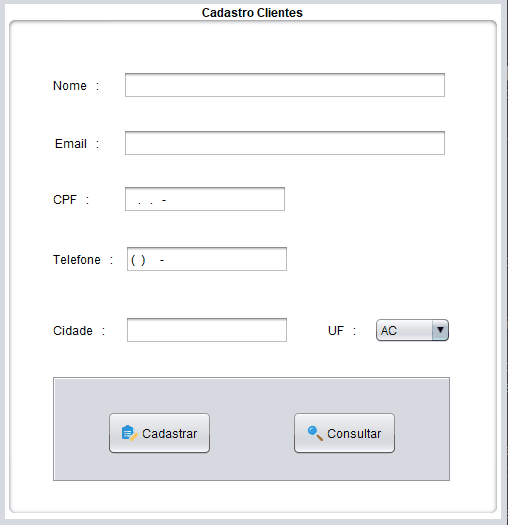

<h1> Cadastro de clientes</h1>

<h4 >
  🏁 Projeto Cadastro 🚀 Finalizado 🏁
</h4>
<h4 >
  🥇Autor: Diogo Henrique🥇
</h4>
 

#
## Sobre o Projeto
O código foi desenvolvido na linguagem JAVA utilizando o banco de dados MySQL, para simular um cadastro e consulta de clientes, com as opções de: cadastrar, consultar, buscar, atualiza e excluir. Minha maior dificuldade foi conectar o java com o banco de dados, mas com muita pesquisa e ajuda de professores, e ajuda dos meus colegas consegui realizar o projeto com sucesso.

#

### Pré-requisitos

Antes de começar, você vai precisar ter instalado em sua máquina as seguintes ferramentas:
[Git](https://git-scm.com).
Além disto é bom ter um editor para trabalhar com o código como [NetBeans](https://netbeans.apache.org/download/index.html) ou [Eclipse](https://www.eclipse.org/downloads/).
E também irá precisar de um banco de dados da sua preferência para armazenar os clientes, eu utilizei o [MySQ](https://www.mysql.com/).
#

<h1 align="center">
    
</h1>